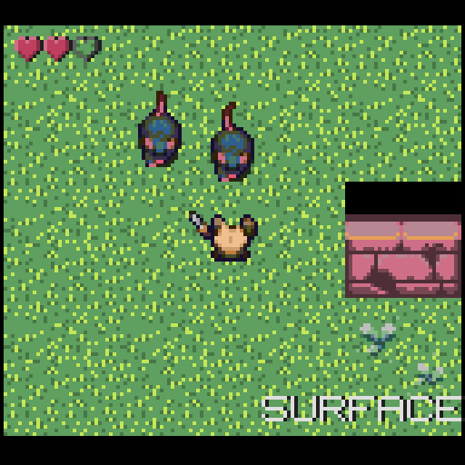
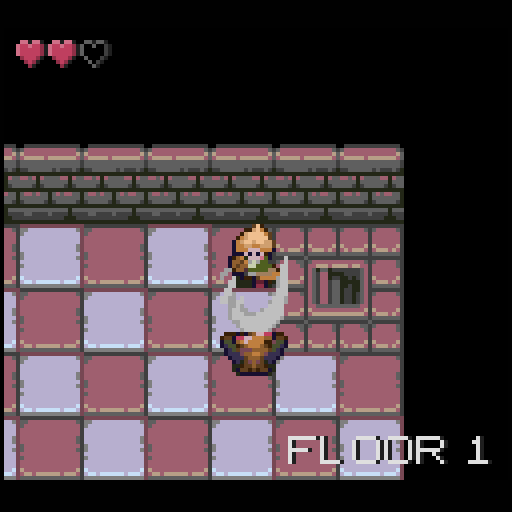
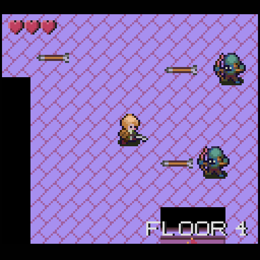

# Accursed Fiend

A dungeon crawling adventure for the GameTank

|  |  |  |
|-----------------|--------------------|--------------------|

## Project notes

Accursed Fiend pushes new limits on the GameTank and demonstrates more effects possible on the hardware.
This is the first game for the system to feature smooth full-screen scrolling and dither-based fade transitions.
It also debuts a queueing system for drawing, so that CPU and blitter operations can be better overlapped.
Finally, this engine uses the graphics memory to its fullest and supports spritesheets/tilemaps up to 256x256!

## building

Build requires cc65, can be located anywhere as long as cc65/bin is in your PATH

make emulate assumes emulator located at ../GameTankEmulator/bin/Windows_NT/GameTankEmulator.exe

make flash assumes eepromProgrammer repo located at ../eepromProgrammer